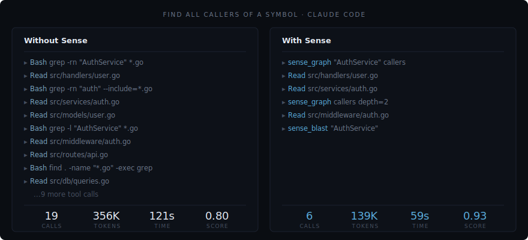

[](https://github.com/luuuc/sense/actions/workflows/ci.yml)  [](https://github.com/luuuc/sense/actions/workflows/codeql.yml) [](https://goreportcard.com/report/github.com/luuuc/sense) [](https://codecov.io/gh/luuuc/sense) [](https://www.bestpractices.dev/projects/12729)

# Sense ⠎⠑⠝⠎⠑

**An MCP server for codebase context, built for AI coding agents.**



Your AI agent reads 19 files to answer "who calls this function?" because it has the text of your codebase but never the map. It re-derives structure on every task, burns tokens chasing grep chains, and hallucinates dependencies that don't exist. Sense indexes your repo once and serves a symbol graph plus semantic code search over MCP. Claude Code, Cursor, Codex CLI, and any MCP client finish the same task in 10 tool calls instead of 19, on 156K tokens instead of 228K, with the same correctness ([bench/](bench/)).

One binary, one local index, four tools for your AI. No SaaS account, no API key, no cloud dependency.

> Sense sits on your machine, has no learning curve, and isn't for you. It's for your AI.

New here? Start with [the Guide](GUIDE.md) for a map to every doc, by who you are.

## What Sense believes

A codebase is structure, not just text. The graph of what calls what, what breaks what, and how the team writes is real, knowable, and worth holding onto. Sense keeps it on your machine and hands it to your AI.

The rest follows from that. Local, because your code is yours. Read-only, because understanding shouldn't require permission to change things. Four tools, because your AI needs a few that work, not a hundred to pick from.

These aren't features. They're the reason Sense looks the way it does.

## What Your AI Gets

Four tools for your AI. A full CLI for you. No sprawl.

| Tool | Capability |
|---|---|
| `sense_graph` | Symbol relationships, callers, callees, inheritance, tests, dead code |
| `sense_search` | Hybrid bi-encoder + cross-encoder semantic code search with keyword and text fallback |
| `sense_blast` | Blast radius, affected code, affected tests, risk score |
| `sense_conventions` | Detected project conventions from source |

Your AI stops reading 30 files to answer "who calls this?" It stops hallucinating dependencies. It stops writing code that's correct but doesn't match how your team writes code.

### Convention detection

Of the four tools, convention detection is the one nobody else does well. AI tools don't just struggle with structure. They struggle with style. They write correct code that doesn't follow how YOUR codebase writes code.

Sense detects patterns from your actual source code: key types and their declarations, framework idioms (Rails associations, Go interfaces, Django models), architectural layers, and naming conventions. Your AI follows these patterns because it sees them, not because it was told about them. Convention detection isn't a feature. It's the thing that makes AI-written code feel like it belongs.

## What changes

Measured across 7 real-world codebases ([Discourse](https://github.com/discourse/discourse), [Flask](https://github.com/pallets/flask), [Next.js](https://github.com/vercel/next.js/), [Axum](https://github.com/tokio-rs/axum), [Gin](https://github.com/gin-gonic/gin), [Javalin](https://github.com/javalin/javalin), and a private e-commerce repo).
Full methodology and raw data: [`bench/`](bench/). Head-to-head leaderboard against Serena, Probe, GitNexus, code-search MCPs: [`docs/bench-leaderboard.svg`](docs/bench-leaderboard.svg).

| Metric | Claude Code (Opus 4.6) | Claude Code (Opus 4.6) + Sense | Change |
|---|---|---|---|
| Tool calls per task | 19 | 10 | -47% |
| Tokens per task | 228K | 156K | -32% |
| Cost per task | $0.42 | $0.31 | -26% |
| Session time | 91s | 73s | -19% |
| Score per 100K tokens | 0.19 | 0.30 | +64% |
| Score per minute | 0.28 | 0.38 | +37% |

Same correctness, dramatically less work. Sense doesn't make the model smarter. It gives the model structural understanding so it stops wasting effort.

### Structural tasks

Tasks that require understanding code relationships, not just reading text, are where Sense pulls ahead.

| Task type | Baseline | + Sense | Why |
|---|---|---|---|
| Blast radius | 0.17 | 0.25 | Pre-computed dependency graph vs. manual grep chains |
| Find callers | 0.27 | 0.33 | Graph lookup vs. reading dozens of files |
| Dead code | 0.00 | 0.05 | Baseline can't do this at all |
| Semantic search | 0.36 | 0.38 | Two-stage retrieval (bi-encoder + cross-encoder) with text fallback |

### Where Sense doesn't help

Sense is structural understanding, not a general search engine. For tasks that are fundamentally text-grep (find a log message, locate a string literal), plain grep is the right tool and Sense adds nothing. Search text fallback (ripgrep) bridges some of this gap, but it's a fallback, not a replacement.

## Install

```bash
curl -fsSL https://luuuc.github.io/sense/install.sh | sh
```

Or download the binary for your OS from the [latest release](https://github.com/luuuc/sense/releases/latest), unzip, and move `sense` somewhere on your `PATH`.

### With Go (1.25+)

```bash
go install github.com/luuuc/sense/cmd/sense@latest
```

## Index Your Codebase

```bash
cd /path/to/project && sense scan
```

Parses your code with tree-sitter, extracts symbols and relationships, embeds everything with a bundled ONNX model, and writes a local `.sense/` index. Incremental on every run.

## Connect Your AI

```bash
cd /path/to/project && sense setup
```

Auto-detects installed AI tools (Claude Code, Cursor, Codex CLI, and OpenCode) and writes each one's integration configs:

- **`.mcp.json`** / **`.cursor/mcp.json`** / **`.codex/config.toml`** / **`opencode.json`**, the MCP server entry for the detected tool (or any MCP client)
- **`CLAUDE.md`** / **`.cursorrules`** / **`AGENTS.md`**, routing guidance with a tool substitution table, written from a single shared source
- **`.claude/settings.json`**, lifecycle hooks that nudge Claude toward Sense tools
- **`.claude/skills/`** and **`.opencode/skills/`**, workflow skills for exploration, impact analysis, and conventions

No manual setup. Run `sense setup` and your AI has structural understanding.

Sense also generates `.sense/summary.md`, a cold-start map of your codebase (top namespaces, hub symbols, entry points, conventions). Your AI reads it at session start and immediately knows the shape of the project. Zero tool calls to orient.

To re-configure after upgrading Sense:

```bash
sense setup
```

## Setup & forget

After `sense setup`, there's nothing left to do. The MCP server your editor already launches watches your working tree in the background and re-indexes changes as they land, so the index stays current whether the edit came from your AI, your own editor, a `git pull`, or a branch switch. No second process to start, no `--watch` to remember. The summary regenerates on every scan. Your AI gets faster answers and burns fewer tokens, and you just stop noticing the friction that used to be there.

## How It Works

Sense parses your codebase with tree-sitter, extracts symbols (functions, classes, modules, methods) and their relationships (calls, imports, inheritance), embeds each symbol with a bundled quantized ONNX model, and stores everything in a local SQLite index at `.sense/`.

```bash
cd /path/to/project && sense scan
```

From that moment on, your AI can ask structural questions via MCP. These are what your AI calls. You can run them manually for verification. See [CLI.md](CLI.md) for the full reference.

The MCP server does more than answer queries: for the life of the editor session it watches the working tree with a debounced filesystem watcher and re-indexes changed files in the background, off the request path. A branch switch re-indexes once from a `git diff` rather than reacting to every file. If you query a file that changed microseconds ago, the server repairs just that file inline before answering, so an edit is never missed. One project indexes at a time — a single-writer lock means a second editor window or a `sense scan --watch` in a terminal serves reads without double-indexing. Set `watch: false` in `.sense/config.yml` to turn the background watcher off.

### Performance

Sense disappears into your workflow. Queries resolve in milliseconds, so your AI reasons about structure without ever stalling.

| Operation | Measured (p50 / p95) |
|---|---|
| Graph query | 0.2ms / 3ms |
| Blast radius | 0.1ms / 10ms |
| Conventions | 16ms / 16ms |
| Cold start | 48ms |
| Full scan | 4.9s |
| Incremental scan | 2.3s |

Measured on Sense's own codebase (382 files, 4,032 symbols). Run `sense benchmark` on your project for local numbers.

## What Sense Is Not

Not a code editor. Not a token optimizer. Not a search engine. Not a feature-count competitor. Not dependent on anything. The non-goals are not omissions, they are the shape of the product. Full account: [NON-GOALS.md](NON-GOALS.md).

## Supported Platforms

| Platform | Status |
|---|---|
| Linux amd64 | Supported |
| Linux arm64 | Supported |
| macOS Apple Silicon (arm64) | Supported |
| macOS Intel (amd64) | Supported (legacy) |
| Windows | Supported using WSL2 |

Windows native builds are not yet available. Use WSL2 with the Linux binary.

macOS Intel still ships a binary and works, but it requires macOS 10.15 (Catalina) or later and is pinned to an older bundled runtime (ONNX Runtime 1.23.1) because Microsoft dropped macOS x86_64 runtime builds after that version. That dependency is frozen and cannot advance, so Apple Silicon is the recommended Mac target.

## Requirements

- ~60 MB disk for the binary
- 100-200 MB for the `.sense/` index (varies with project size)

## Language Support

Sense uses tree-sitter for parsing. It ships with extractors for 13 languages across two tiers:

**Full tier.** Symbols, calls, inheritance, imports, blast radius, semantic search, and framework-specific inference:

| Language | Framework support |
|---|---|
| **Ruby** | Rails (associations, callbacks, routes), Stimulus, Turbo |
| **TypeScript / JavaScript** | React (JSX component calls) |
| **Go** | - |
| **ERB** | Stimulus, Turbo (cross-language edges to JS controllers) |

**Standard tier.** Symbols, calls, inheritance, imports, blast radius, and semantic search:

| Language | Notes |
|---|---|
| **Python** | Django (models, URL patterns), FastAPI (routes, Depends) |
| **Rust** | Structs, traits, enums, impl blocks |
| **Java** | Classes, interfaces, enums, records |
| **Kotlin** | Classes, interfaces, objects |
| **C#** | Classes, interfaces, structs, namespaces |
| **C++** | Classes, structs, namespaces (`::` scoping) |
| **C** | Functions, structs, enums |
| **PHP** | Classes, interfaces, traits (`\` scoping) |
| **Scala** | Classes, traits, objects |

Java, Kotlin, C#, C++, C, PHP, and Scala use a table-driven generic extractor, each ~25 lines of config rather than a handwritten walker. Python and Rust have dedicated extractors, and Python adds Django and FastAPI inference. See [CONTRIBUTING-A-LANGUAGE.md](CONTRIBUTING-A-LANGUAGE.md) to add a new language, and [CONTRIBUTING-A-FRAMEWORK.md](CONTRIBUTING-A-FRAMEWORK.md) to add framework support (plus the dead-code fine-graining that goes with it).

## Articles

Deep-dives on codebase intelligence, the benchmark methodology, and the thinking behind Sense: [ARTICLES.md](ARTICLES.md).

## Feedback

File issues at [github.com/luuuc/sense/issues](https://github.com/luuuc/sense/issues).

## Development

```bash
make build    # build the binary
make test     # run tests
make lint     # run linters
make ci       # all of the above
```

## Contributing

Sense is feature-complete for v1. Outside contributions are accepted in three areas: new languages and frameworks, dead-code fine-graining for a language or framework, and AI-tool integrations. Bug fixes are always welcome; net-new features are not. The full scope and step-by-step guides are in [CONTRIBUTING.md](CONTRIBUTING.md):

- [CONTRIBUTING-A-LANGUAGE.md](CONTRIBUTING-A-LANGUAGE.md), a new language.
- [CONTRIBUTING-A-FRAMEWORK.md](CONTRIBUTING-A-FRAMEWORK.md), framework support and dead-code fine-graining.
- [CONTRIBUTING-AN-AI-TOOL.md](CONTRIBUTING-AN-AI-TOOL.md), a new AI coding tool integration.

## License

MIT. See [LICENSE](LICENSE).
